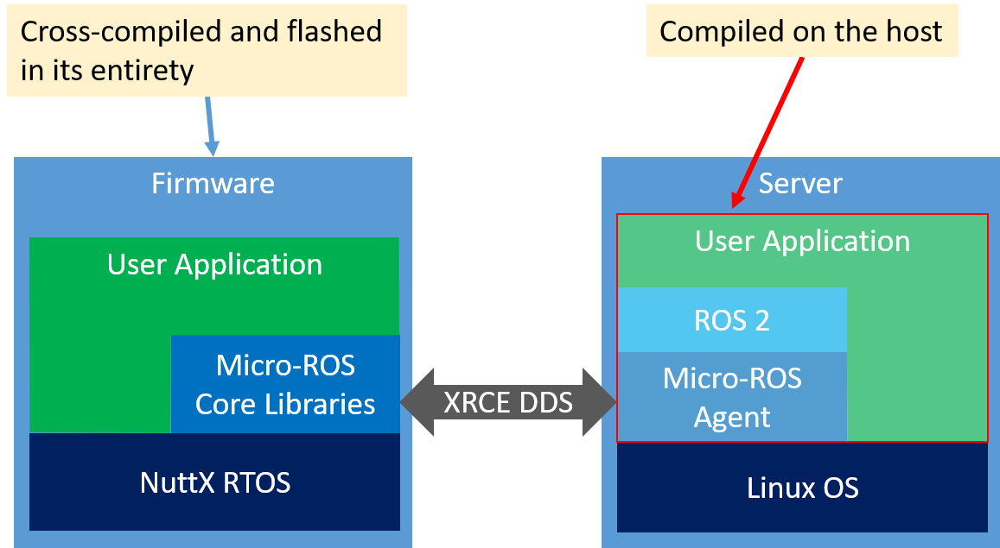

# micro-ros-setup

This package assists with setting up the workspaces for Micro-ROS to compile from source, which is currently the recommended way to install Micro-ROS.

## Prerequisites

This version of the package targets  **ROS 2 Crystal** and has been tested on **Ubuntu 18.04** only! Other Linux distributions may work -- if you find issues, [please report them](https://github.com/micro-ROS/micro-ros-build/issues). 

For installing ROS 2, we recommend the [binary build of ROS 2](https://index.ros.org/doc/ros2/Installation/Crystal/). Note that if you use a non-package install, you may have to adjust some of the "source" commands below.

We will use the standard ROS 2 meta build-tool, `colcon`, to compile. If you haven't used colcon, yet, you can probably just copy the instructions below as-is. I recommend [getting familiar with colcon](https://index.ros.org//doc/ros2/Tutorials/Colcon-Tutorial/), though, it has many useful options.

## Concepts

Micro-ROS is a client-server system: The embedded micro-controller runs the client, and the "agent" runs on Linux (or potentially also Windows, though this package doesn't support that, yet).

Software on a microcontroller is usually called "firmware" and it is cross-compiled on the host and then flashed onto the microcontroller. The following structure image shows the individual parts:


Correspondingly, in the micro-ROS build, we distinguish the firmware and the "regular" workspace for the server side. Since the regular workspace contains the agent, in other documentation it also sometimes called "agent workspace".

# Installation

This is, overall, a four-step process.

## 1/4 Setting up the workspace

It is best to start with a fresh workspace, both to speed up compiles and to avoid unintended interference. 

```shell
source /opt/ros/crystal/setup.bash
sudo apt install python-rosdep
mkdir -p uros_ws/src
cd uros_ws
git clone --recursive https://github.com/micro-ROS/micro-ros-build.git src/micro-ros-build
```

All subsequent instructions assume that you're running them in the `uros_ws` directory. 


## 2/4 Building this package

```shell
colcon build --packages-select micro_ros_setup
source install/local_setup.bash
```

## 3/4 Building the Micro-ROS agent

```shell
ros2 run micro_ros_setup create_agent_ws.sh  # add agent packages
colcon build
source install/local_setup.sh
```

Note that, by default, the `create_agent_ws.sh` used below will add the packages to the `src` directory. This is easiest, but you can also create a separate workspace by giving it an argument, if you wish.


## 4/4 Building the client (aka firmware)

```shell
ros2 run micro_ros_setup create_firmware_ws.sh
cd firmware/NuttX
tools/configure.sh configs/olimex-stm32-e407/drive_base # FOR EXAMPLE!
cd ../..
ros2 run micro_ros_setup build_firmware.sh
```

These commands create the firmware workspace and then configure an example NuttX build that uses Micro-ROS.

# Deployment and Usage

## Flashing the firmware

In contrast to software on the host, which is runnable from the workspace after you compiled it, to use the firmware you need to flash it to the microcontroller's built-in storage first.

```shell
cd firmware/NuttX
scripts/flash.sh olimex-stm32-e407
```
